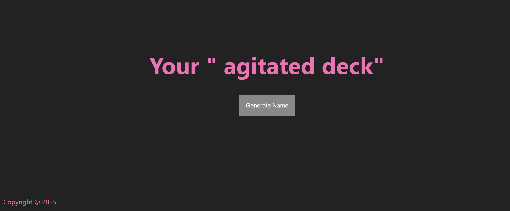
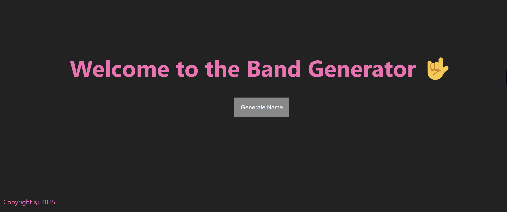

# 🎸 Band Name Generator

A fun little project built with **Node.js** and **Express** that generates a random band name when you click a button!

## 🚀 Features
- Generates random combinations of adjectives and nouns
- Built using **EJS** templates for dynamic HTML rendering
- Simple and clean **CSS** styling
- Express server to handle routes and submissions

## 📂 Project Structure
band-generator/ ├── public/ │ └── styles/ │ └── main.css ├── views/ │ ├── partials/ │ │ ├── header.ejs │ │ └── footer.ejs │ └── index.ejs ├── index.js ├── package.json └── README.md

## 📦 Installation
1. Clone the repository:
   ```bash
   git clone https://github.com/TON-USERNAME/band-generator.git
   cd band-generator
2. Install dependencies:
   ```npm install
3. Run the app:
   nodemon index.js
4. Open your browser and go to: http://localhost:3000
## ✨ Preview

### 🎵 Main page:


### 🎨 Front page illustration:


## 📄 License
This project is open source and available under the MIT License.